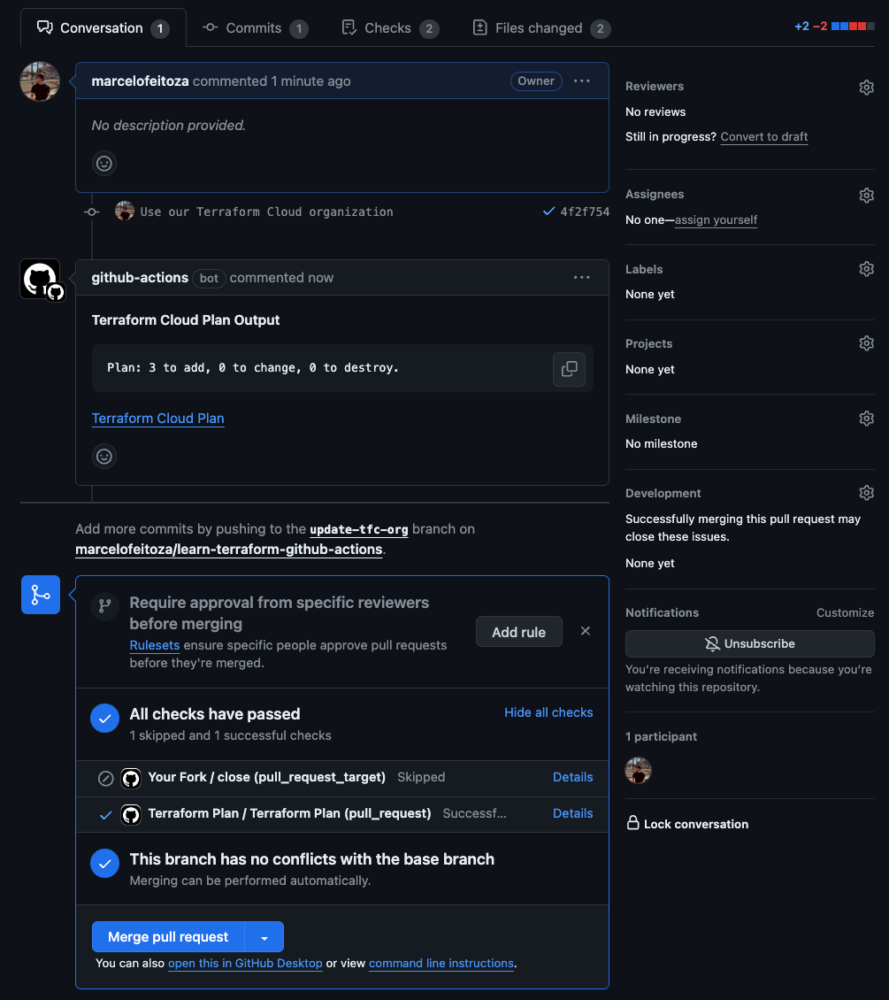
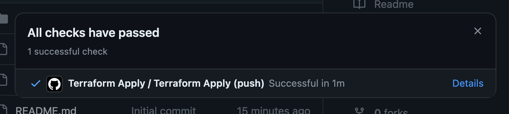
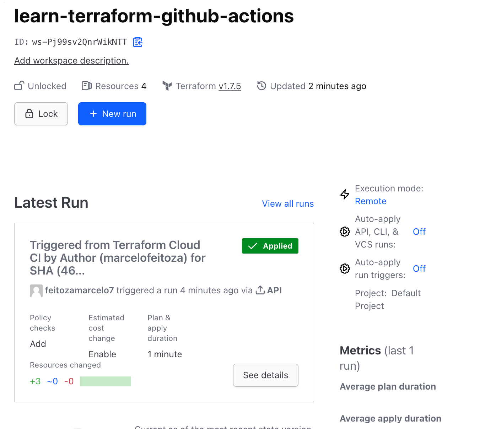
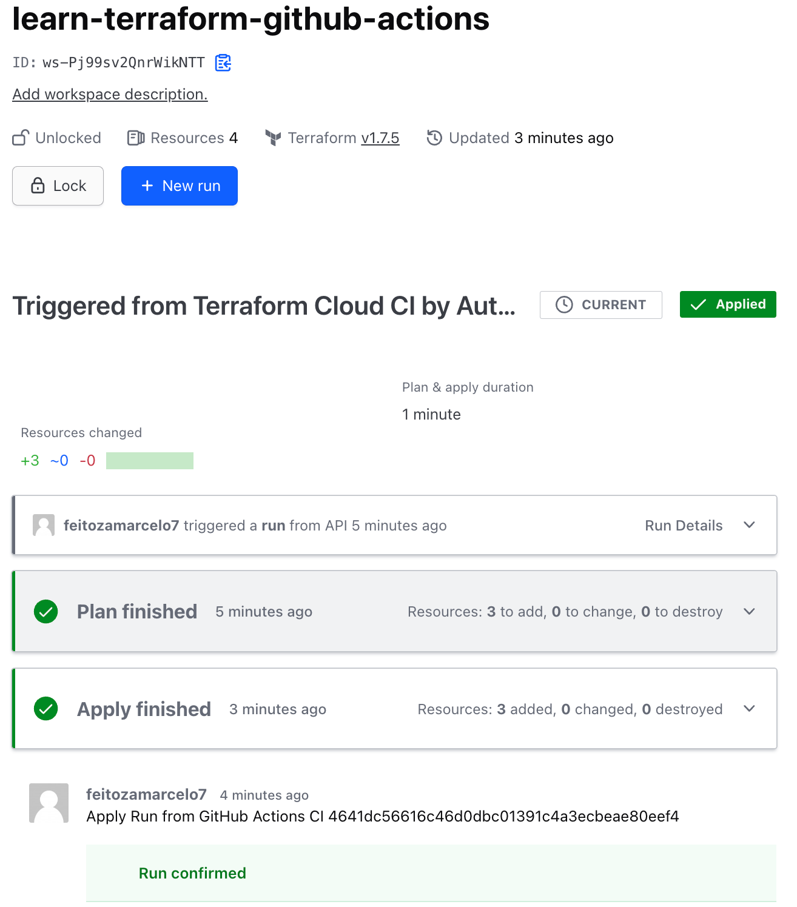
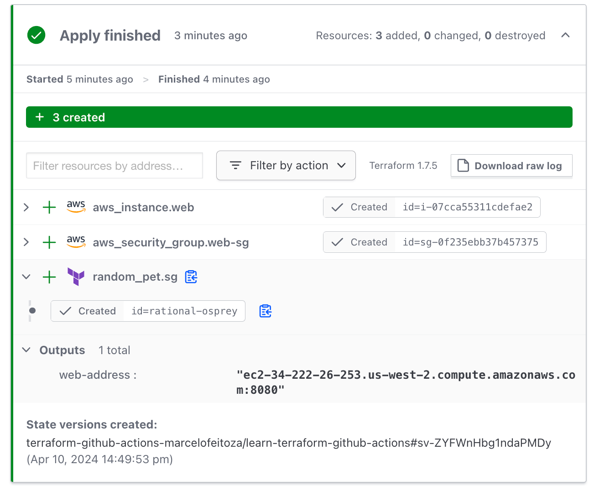

<!-- 

 -->
# Relatório sobre Automatização de Infraestrutura com Terraform e GitHub Actions

## Introdução

O [Terraform](https://www.terraform.io/) facilita a maneira de criarmos a infraestrutura de nossos datacenters. Com sua abordagem baseada em infraestrutura como código, o Terraform nos permite descrever e provisionar recursos de maneira eficiente e declarativa, tanto em ambientes de nuvem quanto locais.

## Principais Aprendizados

### Infraestrutura como Código

A prática de IaC nos capacita a gerenciar nossa infraestrutura por meio de arquivos de configuração codificados, eliminando a necessidade de ajustes manuais. Essa abordagem nos traz ganhos significativos em automação, consistência e rastreabilidade.

### Estruturação de Recursos

No Terraform, definimos nossa infraestrutura em arquivos de configuração utilizando uma linguagem declarativa. Isso nos permite expressar o estado desejado dos nossos recursos de forma clara e concisa, deixando que o Terraform se encarregue de implementá-lo.

### Provedores de Serviços

Com suporte a uma vasta seleção de provedores de nuvem, como AWS, Azure e Google Cloud, o Terraform nos dá a flexibilidade de gerenciar recursos específicos de cada plataforma.

### Gerenciamento de Estados

O estado do Terraform mantém um registro preciso dos recursos gerenciados, facilitando a identificação e aplicação das alterações necessárias para atingir o estado desejado.

### Automação com GitHub Actions

As GitHub Actions nos permitem criar fluxos de trabalho automatizados, integrando perfeitamente com o Terraform para provisionar e gerenciar nossa infraestrutura com eficiência e precisão.

## Exemplo Prático

Neste projeto, exploramos a automação do provisionamento de infraestrutura na AWS utilizando o Terraform em conjunto com GitHub Actions. O processo automatizado inclui etapas como:

- Instalação do Terraform
- Inicialização do Terraform
- Validação dos arquivos de configuração
- Aplicação das alterações para provisionar a infraestrutura

## Evidência

Aqui estão algumas capturas de tela que ilustram a execução bem-sucedida do nosso projeto:

*Pull request aberto para alterações na infraestrutura*

*Deploy bem-sucedido após a aplicação das alterações*

*Última execução do fluxo de trabalho no GitHub Actions*

*Execução do comando `terraform apply`*

*Finalização da aplicação das alterações pelo Terraform*

*Instância EC2 com "Hello World" em execução*
